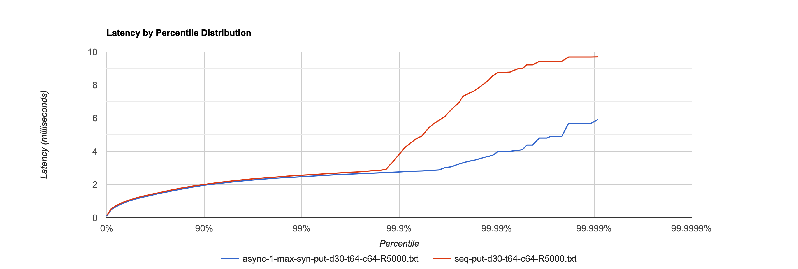
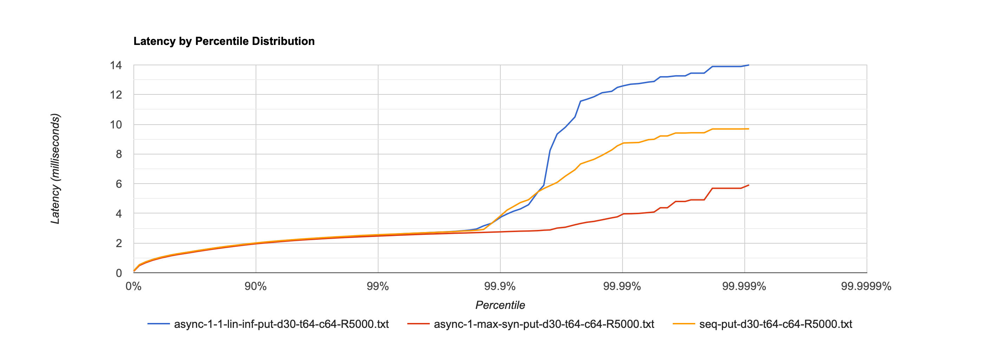
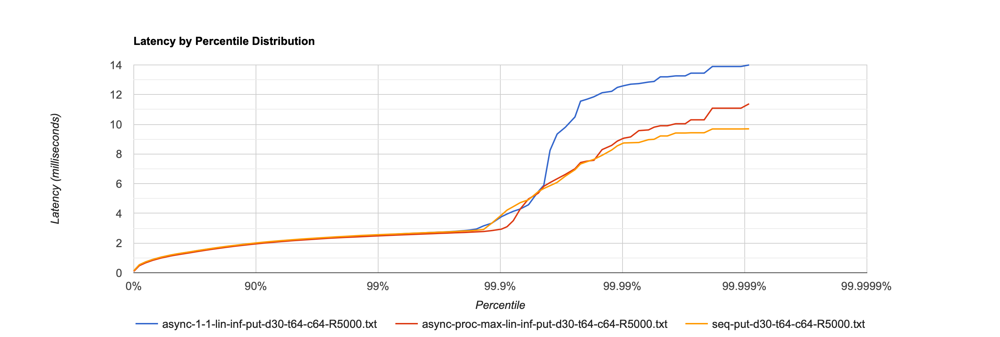
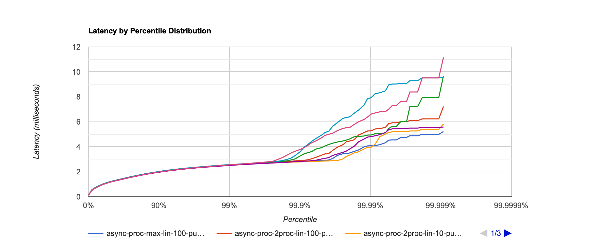
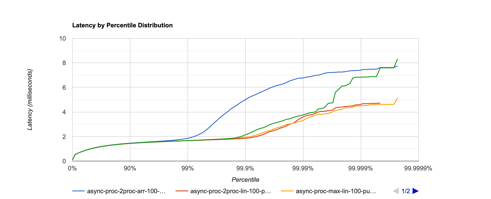

# Report stage 2
## Подбор параметров `ExecutorService`

Посмотрим, стал ли сервер работать лучше после того, как мы разгрузили `SelectorThread`ы. Будем изменять параметры и 
сравнивать с предыдущим этапом с помощью нагрузочного тестирования. На момент начала тестирования база заполнена 
примерно на 230mb. Для тестирования используем скрипт [`put.lua`](../wrk_scripts/put.lua). В качестве `id` используются
рандомные строки длины [10,100], в качестве `body` - рандомные строки длины 300.

### SynchronousQueue

```java
int corePoolSize = 1
int maximumPoolSize = Integer.MAX_VALUE
BlockingQueue<Runnable> workQueue = new SynchronousQueue<>()
```

В качестве очереди используем `SynchronousQueue`, а количество воркеров разрешим любое. Таким образом, когда будет
прилетать новая задачка, она будет делегироваться любому активному треду или сразу будет создаваться новый тред. Сравним
с последовательным сервером на одних параметрах.

#### `PUT` requests, RPS: 5000, Connections: 64, Threads: 64, Duration: 30s

Ожидаемо, асинхронный сервер обрабатывает запросы быстрее. Однако с таким подходом однажды мы достигнем максимального
количества потоков и получим reject. Попробуем взять другую очередь.



### LinkedBlockingQueue

```java
int corePoolSize = 1
BlockingQueue<Runnable> workQueue = new LinkedBlockingQueue<>()
```

Так как `LinkedBlockingQueue` в данном случае не ограничена по размеру, то она никогда не заполнится, а значит 
`maxPoolSize` не имеет значения, всегда будет использоваться фиксированное количество тредов `corePoolSize`.

#### `PUT` requests, RPS: 5000, Connections: 64, Threads: 64, Duration: 30s

Ожидаемо этот вариант работает медленнее, чем все рассмотренные прежде, потому что, он пускает все задачи в 1 поток,
тогда как в предыдущем этапе задачи выполняются в тредах-селекторах, которых фиксированное количество, а в случае с
`SynchronousQueue` тредов вообще сколько угодно.



Заметим, что если не указывать явно количество селекторов при создании [`MyHttpServer`](../MyHttpServer.java), в
конструкторе `Server` их аллоцируется столько же, сколько и доступных процессоров. Поставим столько же воркеров.

```java
int corePoolSize = Runtime.getRuntime().availableProcessors()
BlockingQueue<Runnable> workQueue = new LinkedBlockingQueue<>()
```

Как и ожидалось, этот вариант будет работать примерно так же, как и вариант из предыдущего этапа.



Сделаем вывод, что чем больше `corePoolSize`, тем лучше latency. Однако вариант с неограниченной очередью нас тоже не
устраивает, потому что однажды мы можем получить `OutOfMemoryException`. Рассмотрим очереди с capacity.

### LinkedBlockingQueue with capacity and ArrayBlockingQueue

Если мы ограничиваем размер очереди, у нас появляется новый сценарий - максимальное количество тредов загружено и 
очередь заполнена. В таком случае введём `RejectedExecutionHandler` чтобы корректно обрабатывать такие случаи. Завернём
`Runnable` в `Task`, чтобы передавать в `ExecutorService` сессию, а в `reject()` будем отправлять в сессию
`Response.PAYMENT_REQUIRED`.

Попробуем нагрузить `LinkedBlockingQueue` и fair `ArrayBlockingQueue` `PUT` запросами при разных 
параметрах `queue capacity` (10 и 100) и `maxPoolSize` (`Integer.MAX_VALUE` и `2 * corePoolSize`). `corePoolSize = 
Runtime.getRuntime().availableProcessors()`

#### `PUT` requests, RPS: 5000, Connections: 64, Threads: 64, Duration: 30s

Интересно, что при использовании обеих очередей, с `queue capacity = 10` и `maxPoolSize = 2 * corePoolSize` мы получили
небольшое количество rejectов (меньше 0,001% от всех запросов). Сделаем вывод, что для такого размера очереди pool
должен быть больше. 

Лучше всех в данном сравнении себя показала `LinkedBlockingQueue` с `queue capacity = 100` и `maxPoolSize = 
Integer.MAX_VALUE`.



Продолжим сравнение на более высоких RPS исключив варианты с rejectами и добавив non-fair `ArrayBlockingQueue`.

#### `PUT` requests, RPS: 20.000, Connections: 64, Threads: 64, Duration: 30s

Fair `ArrayBlockingQueue` показала себя очень неэффективной, улетев до средней latency в 100ms, поэтому для наглядности
на графике результатов с ней нет. `LinkedBlockingQueue` и non-fair `ArrayBlockingQueue` с `queue capacity = 10` и 
`maxPoolSize = Integer.MAX_VALUE` привели к`OutOfMemoryError`: сервер пытался выделить больше потоков, чем физически 
позволяло железо, а при ограничении `maxPoolSize = 2000` (примерно такой предел) выдавал много rejectов, поэтому
этих ситуаций также нет на графике. Интересно, что такого не произошло только с fair `ArrayBlockingQueue` с такими же
параметрами: она ответила на все запросы, но опять же очень медленно.

Лучше всех отработала `LinkedBlockingQueue` с `queue capacity = 100` независимо от `maxPoolSize`.



### Сравнение очередей на профилях

Мне стало интересно, почему `LinkedBlockingQueue` работает лучше, чем non-fair `ArrayBlockingQueue`, поэтому я решила
посмотреть на профили.

#### `PUT` requests, RPS: 20.000, Connections: 64, Threads: 64, Duration: 30s

Профили CPU и аллокаций не показали никаких существенных различий ([lin-cpu.html](flame_graphs/stage2/lin-cpu.html), 
[arr-cpu.html](flame_graphs/stage2/arr-cpu.html), [lin-alloc.html](flame_graphs/stage2/lin-alloc.html),
[arr-alloc.html](flame_graphs/stage2/arr-alloc.html)).


[//]: # (Using large queues and small pools minimizes CPU usage, OS resources, and context-switching overhead, but can 
lead to artificially low throughput. If tasks frequently block &#40;for example if they are I/O bound&#41;, a system may
be able to schedule time for more threads than you otherwise allow. Use of small queues generally requires larger pool 
sizes, which keeps CPUs busier but may encounter unacceptable scheduling overhead, which also decreases throughput.)